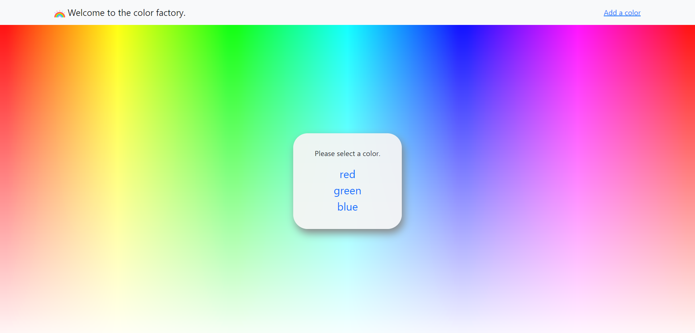

# React Router Color Factory 

## Description: 

An application created with React Router's BrowserRouter, Switch, Redirect, useHistory, and useParams. User can pick a color from a color picker form and view the color after clicking on a dynamically added Link on the main page. 

## Tools Used: 

* [React.js](https://reactjs.org/)
* [React Router](https://reactrouter.com/en/6.6.2/start/overview#feature-overview)
* [React Bootstrap](https://react-bootstrap.netlify.app/getting-started/introduction/)